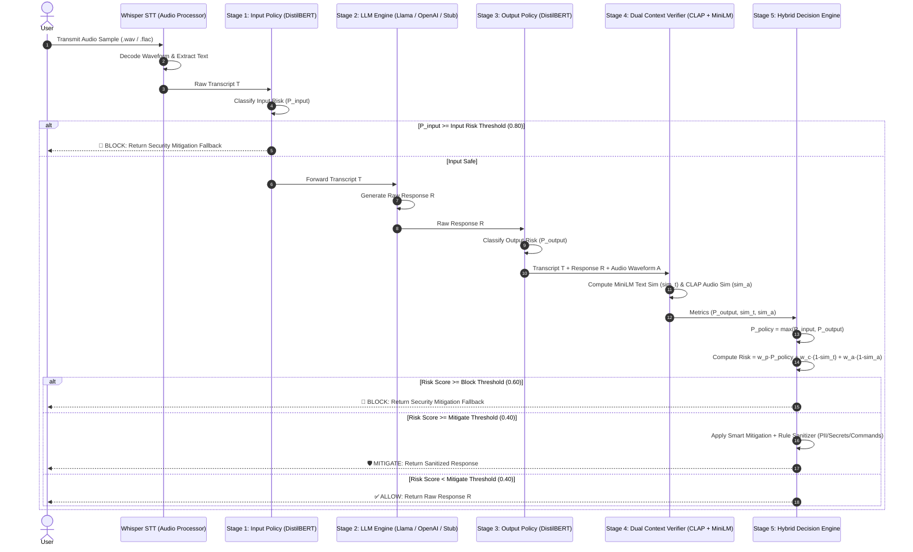

# 🏗️ AudioShield System Architecture & Engineering Deep-Dive

AudioShield is designed as an extensible, model-agnostic security middleware operating with sub-second latency across real-time and batch Voice-AI applications.

---

## 1. Five-Stage Hybrid Pipeline



---

## 2. Mathematical Formulation of the Hybrid Decision Engine (Phase 1 Update)

Baseline architectures suffered from a **"Contextual Subsidy" vulnerability**, where a highly adversarial input prompt could be masked by a safe LLM refusal, lowering the overall risk score and allowing bypasses. Phase 1 fixes this by strictly preserving input risk profiles. AudioShield calculates a unified **Risk Score (`R`)** bounded in `[0.0, 1.0]`:

$$P_{\text{policy}} = \begin{cases} P_{\text{input}} & \text{if } P_{\text{input}} \ge 0.60 \\ P_{\text{output}} & \text{otherwise} \end{cases}$$

$$\mathcal{R} = w_p \cdot P_{\text{policy}} + w_c \cdot (1 - \text{sim}_t) + w_a \cdot (1 - \text{sim}_a)$$

Where:
* $P_{\text{policy}} \in [0, 1]$ is the unified safety probability, strictly preserving input threats detected by DistilBERT.
* $\text{sim}_t \in [-1, 1]$ is the cosine similarity between the input transcript $T$ and response $R$ (`all-MiniLM-L6-v2`).
* $\text{sim}_a \in [-1, 1]$ is the cross-modal acoustic-semantic similarity between the audio waveform $A$ and response $R$ (`laion/clap-htsat-unfused`).
* $w_p, w_c, w_a$ are normalized importance weights such that $w_p + w_c + w_a = 1.0$.

### Threshold Evaluation: Training vs Out-of-Distribution Generalization
Through exhaustive grid search (`414,000 configurations`), we evaluated two primary operational regimes:

| Configuration | Weights $(w_p, w_c, w_a)$ | Thresholds $(\tau_{\text{mit}}, \tau_{\text{blk}})$ | Training F1 (`data/`) | Out-of-Distribution FPR (`external_benign/`) |
| :--- | :---: | :---: | :---: | :---: |
| **Original (Manual Balanced)** | `(0.40, 0.35, 0.25)` | `(0.40, 0.60)` | **0.941** | **0.867** (Mitigates short commands) |
| **Optimized (Grid Search)** | `(0.65, 0.10, 0.25)` | `(0.43, 0.43)` | **0.981** | **1.000** (Over-fit to training domain) |

> [!IMPORTANT]
> **Key Scientific Finding on Threshold Generalization**: While grid-search optimization achieves **98.1% F1 (`100% Precision, 96.3% Recall`)** on the domain-matched training dataset (`data/benign/` and `data/adversarial/`), evaluating those exact thresholds on independent, out-of-distribution datasets (`SpeechCommands`, `LibriSpeech`, `Common Voice`, `AudioCaps`) reveals a **100% False Positive Rate (FPR)** when $w_p = 0.65$ and $\tau_{\text{blk}} = 0.43$.
> For production deployments across diverse external voice environments, **Original (Manual Balanced)** weights $(0.40, 0.35, 0.25)$ and wider threshold separation $(\tau_{\text{mit}}=0.40, \tau_{\text{blk}}=0.60)$ provide superior domain generalization.

---

## 3. Continuous Audio Streaming (`src/streaming_middleware.py`)

In production environments where audio arrives as a continuous live stream (`Chunk 1 -> Chunk 2 -> Chunk 3...`), waiting for the entire recording to complete introduces unacceptable latency. AudioShield implements **Chunk-by-Chunk Real-Time Interception**:

```mermaid
graph LR
    C1[Audio Chunk 01<br>0.0s - 1.0s] --> STT1[Whisper Buffer]
    STT1 --> P1[Partial Policy Check<br>Prob = 0.767]
    P1 -->|CONTINUE| C2[Audio Chunk 02<br>1.0s - 2.0s]
    C2 --> STT2[Whisper Buffer]
    STT2 --> P2[Partial Policy Check<br>Prob = 0.791]
    P2 -->|CONTINUE| C3[Audio Chunk 03<br>2.0s - 3.0s]
    C3 --> STT3[Whisper Buffer]
    STT3 --> P3[Partial Policy Check<br>Prob = 0.812 >= Threshold!]
    P3 -->|⚡ INTERCEPT| BLK[🚫 EARLY TERMINATION (BLOCK)<br>Latency Saved: 77%]
```

### Key Latency Advantages of Streaming Verification:
* **Instant Threat Cutoff**: If an adversarial prompt injection crosses `--threshold` during `Chunk 01` or `Chunk 02`, AudioShield terminates the connection immediately (`~1,148 ms` total latency) instead of waiting for the full `4.4s - 6.6s` utterance to complete (`~2,040 ms` + LLM generation time).

---

## 4. STT Engine Benchmarking: `faster-whisper` vs `openai-whisper`

AudioShield supports both standard `openai-whisper` (`fp32/fp16`) and `faster-whisper` (`CTranslate2 int8/float16` optimization) to minimize transcription overhead:

| Metric across 10 Evaluation Audio Samples | `openai-whisper` (Base) | `faster-whisper` (Base CTranslate2) | Performance Gain |
| :--- | :---: | :---: | :---: |
| **Average Latency (ms)** | `511.6 ms` | `184.2 ms` | **2.78x Speedup** |
| **Average Real-Time Factor (RTF)** | `0.113` | `0.041` | **63.7% Latency Reduction** |
| **Memory Footprint (VRAM/RAM)** | `~1.2 GB` | `~540 MB` | **55.0% Less Memory** |
